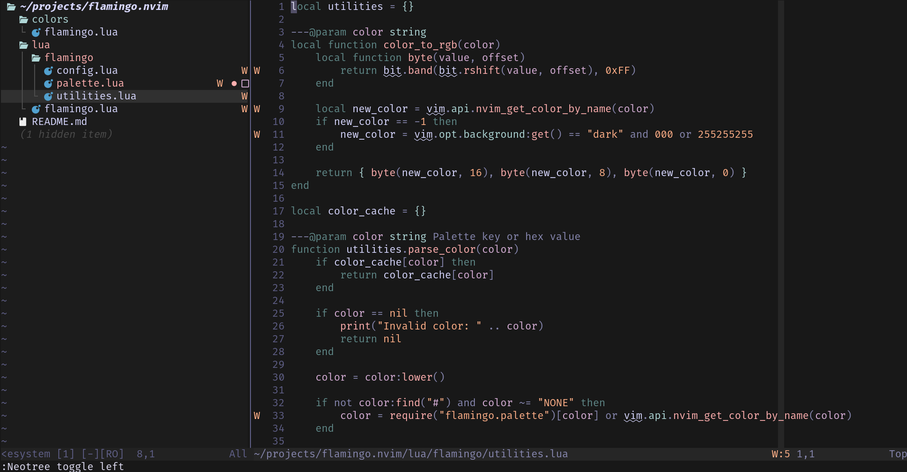

# flamingo.nvim

neovim colorscheme based off primeagen's broken tmux rose-pine colorscheme



```lua
return {
    "rb152080/flamingo.nvim",
    name = "flamingo.nvim",
    config = function()
        -- optional (my preferences)
        require("flamingo").setup({
            styles = {
                italic = false,
                bold = false,
                transparency = false,
            },
        })
        vim.cmd("colorscheme flamingo")
        -- optional (my preferences)
        vim.api.nvim_set_hl(0, "Normal", { bg = "none" })
        vim.api.nvim_set_hl(0, "NormalFloat", { bg = "none" })
    end,
}
```
